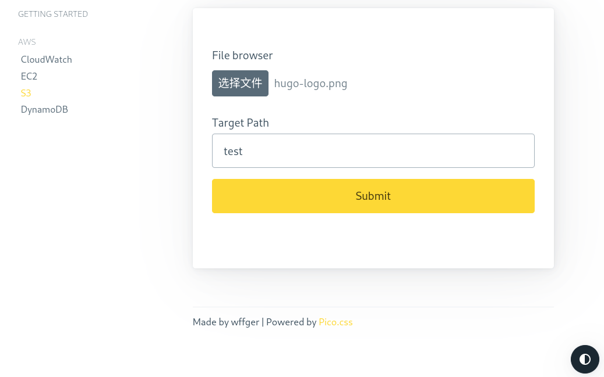

# cloud-desk
云桌，一个站点操作多种云资源

## introduce
后端使用fastapi，项目结构参考[fastapi-services-oauth2](https://github.com/viktorsapozhok/fastapi-services-oauth2)  
前端使用jinja2，样式使用[Pico.css](https://picocss.com/docs/)

## init
```
cd cloud-desk
py -m venv venv/cloud-desk
source venv/cloud-desk/bin/activate
pip install --upgrade pip
pip install -r requirements.txt
```

## run
```
cd app
uvicorn main:app --reload
```

## look
